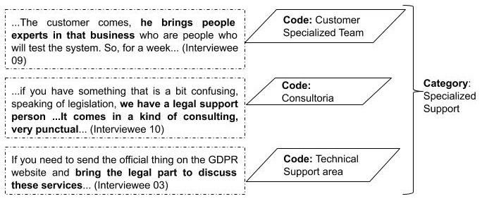
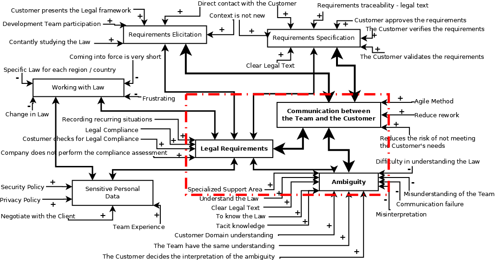

<html>
  
  <h2> How public and private companies address ambiguity and compliance in legal requirements specification?</h2>

 This web page presents the supplementary material of the paper: How public and private companies address ambiguity and compliance in legal requirements specification?

<h3>Authors: Ommited</h3>

<h3><b>Abstract</b></h3>

Natural language is largely used to specify software requirements, but it brings challenges as it is prone to produce ambiguous specifications. These challenges become bigger when dealing with software requirements that must comply with regulations, the so-called legal requirements. In previous work, we investigated in nine employees of eight public and private companies the state of practice to tackle ambiguity of legal requirements and their compliance with regulations. This work extends the previous study by including other ten employees of seven companies in the investigation of how the software development industry addresses ambiguity in legal requirements specification and how it achieves legal compliance. A qualitative study, based on semi-structured interviews, was performed with nineteen professionals from different companies who presented their views on the RE process, including legal compliance and ambiguity resolution of legal requirements. Data was collected using audio-recorded and analyzed using coding techniques. Findings revealed that a culture of privacy compliance regarding protection of personal data must be created because the company as a whole must comply with the law. Ambiguity resolution and legal compliance in software requirements are based on discussions between the team, the customer and the specialized support area (compliance, legal, ambiguity identification). Also, the participation of experienced team members and domain knowledge help to identify if a given data is sensitive and if it is essential for the system. These strategies reduce rework and the risk of non-compliance.

  

  
  <h3>Data Collection</h3>
  
  
 A semi-structured interview was performed using an interview script specifically designed and composed of open-ended questions

<a href="https://github.com/dorgivalnetto/COMPSAC20/blob/gh-pages/SupplementaryMaterial-SBES_2019.pdf">Interview Script </a>

  
  <h3>Data Analysis</h3>
  
  
 Considered labeled portions of text using codes (we started with open coding, then we did axial coding, and finally, weused selective coding). 

<a href="https://github.com/dorgivalnetto/SBES2019/blob/gh-pages/open%20coding.xls"> Open Coding </a>
 
<a href="https://github.com/dorgivalnetto/sbes19/blob/gh-pages/axial%20coding.xls"> Axial Coding </a>
 

 Subsequently, the relationships between categories were mapped to identify their influences about the requirements specification process with reduced ambiguity and legal compliance. Figure 1 illustrates the category creation process.

 Four basic categories (<i>Requirements Elicitation</i>, <i>Requirements Specification</i>, <i>Working with Law</i>, <i>Sensitive Personal Data</i>) and three core categories (<i>Communication between the Team and the Customer</i>, <i>Legal Requirements</i> and, <i>Ambiguity</i>) were found. The core categories are highlighted by the rectangle with the dashed border in red. The arrows that relate a factor to a category have a signal plus or minus representing, respectively, positive or negative influences from the factors to these categories. For example, <i>Change in the Law</i> is a negative factor for those <i>Working with Law</i> because this change has an impact on the processes. The contribution (positive or negative) of each category over the main categories were derived from the interpretation of the interviews and authors’ analysis data. The smaller bidirectional arrows between the categories represent that they were associated with the interviews. The larger bidi-rectional arrows connecting only core categories, represent the relationships with higher importance, i.e., to address ambiguity in legal requirements, the <i>Communication between the Team and the Customer</i> is critical. To ensure a successful <i>Requirements Elicitation</i> and <i>Requirements Specification</i>, <i>Communication between the Team and the Customer</i> is critical. Figure 2 presents the categories and their related factors. 

</html>
